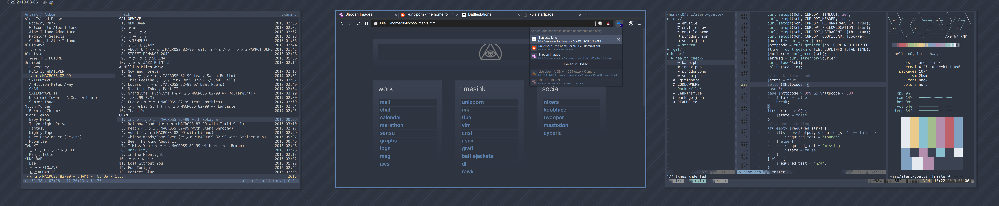

-----BEGIN PGP SIGNED MESSAGE-----
Hash: SHA512

```
 ___/\  _____ /\______ ____/\   ___/\
 \ _  \/  .://.:\____//_\_.  \ /./__ \
  \\  /    //    ___//  .\/ _// \  /  \
  /.: \    \_.     //    _. \/ .:\/   /
 /____/\  __\/__  //______| /\_______/
        \/      \/        |/x0^b7^imp!
```

# attribution

 - i am xero
	- x0^67^aMi5H^iMP!
	- https://xero.nu
	- /u/x_ero
 - i have a public key with the fingerprint of: `0xAC1D0000`
	- 15A4 B803 F8EF F47E 7A21 5049 0DA7 AB45 AC1D 0000
 - and is available here:
	- https://0w.nz/pgp.pub
	- https://keybase.io/xero
 - my dotfiles repo:
	- https://git.io/.files
	- https://code.xero.nu/dotfiles
 - this screenshot represents the state of this repo as of `7d740f0`
	- https://github.com/xero/dotfiles/commit/7d740f0dd1669b6ef7f1ae647b7a5c3f10dc1833

# screenshot



 - [gh raw](https://raw.githubusercontent.com/xero/dotfiles/master/previews/nord.png)
 - [imgur mirror](https://i.imgur.com/6lrHHNT.png)

# details

 - wm: [2bwm](https://github.com/xero/2bwm)
	- [dmenu](https://github.com/xero/dmenu)
	- [dunst](https://github.com/xero/dotfiles/blob/master/2bwm/.config/dunst/dunstrc)
	- [sxhkd](https://github.com/xero/dotfiles/blob/master/2bwm/.config/sxhkd/sxhkdrc)
	- [cathexis-nord gtk theme](https://github.com/xero/dotfiles/tree/master/themes/.themes/cathexis-nord)
	- wallpaper:
		- `[~/bin/hashwall](https://github.com/xero/dotfiles/blob/master/bin/bin/hashwall) -f '#3b4252' -b '#2e3440' -s 12`
 - browser: [brave](https://brave.com) 
	- [startpage](http://git.io/start-page)
		- extensions:
			- [new tab redirect](https://chrome.google.com/webstore/detail/new-tab-redirect/icpgjfneehieebagbmdbhnlpiopdcmna)
			- [quick tabs](https://chrome.google.com/webstore/detail/quick-tabs/jnjfeinjfmenlddahdjdmgpbokiacbbb)
			- [cvim](https://chrome.google.com/webstore/detail/cvim/ihlenndgcmojhcghmfjfneahoeklbjjh)
			- [stylus](https://chrome.google.com/webstore/detail/stylus/clngdbkpkpeebahjckkjfobafhncgmne)
				- [style overrides](https://git.io/stylez)
 - terminal: [urxvt](https://git.io/.urxvt)
	- [nord colors](https://github.com/arcticicestudio/nord)
	- [cmus](https://git.io/.cmus)
	- [tmux](https://git.io/.tmux)
	- [zsh](https://git.io/.zsh)
	- [neovim](https://git.io/.vim)
	- scriptz:
		- [sysinfo](https://git.io/vV0mB) 
		- [colorbars](https://github.com/xero/dotfiles/blob/master/fun/bin/colorbars-sm)
	- font: 
		- [hack](https://aur.archlinux.org/packages/ttf-nerd-fonts-hack-complete-git/) + devicons
		- [symbola](https://aur.archlinux.org/packages/ttf-symbola/) for unicode coverage
			- using some non-bitmap fonts to spice things up!

to claim this, i am signing this object:

-----BEGIN PGP SIGNATURE-----

iQIzBAEBCgAdFiEEFaS4A/jv9H56IVBJDaerRawdAAAFAlyAIaAACgkQDaerRawd
AAD0+g//XnmSwMLnbp9nR4TF2kvcxKwtaB6k/KMHEQtPKZl3KyUALukI9HlvmatO
q995id5VyfKvn79qxrdVEkI7LRw+BohqwFK9cKW3D2n06Rb2WqYy9Xrz0izEzJwI
Uc7rEDpgsH0/K+w6PZZrrD65IqYBGaZQDyzq8JE0Z5mtfX26Vn/NEboIp22OF6/9
u70GTiTjKsO/tR+Z3ZV1egW1qIABs1qUhY9Nbr7S62vcTSpTOsXoEMk7RSrRmZW9
g8qhIWKzZqJWDy0aS2zYL/ScJeVzeCKQi69xgRMJmjcCGBl8M4PFMnWHG+io8Fo2
uY+6c53lCVl/zPk0x5wcCESoiTFoYrZPk8c6e+i2VmwcpipU7ZXOJ2v49Xds18Ve
MNmXPoKcmK6IOvbqAKZyO8QmTVVwRHuFWIOwQZEr3saOFhzRaU7gzEvfwxaBP3VP
AiVz2Rv8Hhizc7b96NMo4CnKKrES3iX+xNkAo2uOGSwIiaiTtsOK36erHao1o2y/
lrdZNQOUhQOpSqC/NZYWVnfTAc00AVR0YDrmKlAIIy7MjU12C7lt4iwiW2uhiCJ0
HehMLIsAR20MIlh0EyPJ8b9T+oK697RGMsuMQguF9rnnb3uckbRX4lmX7A9VTEg+
jBuW1cHj93ePAznyo4S5bpOknvw8rgeGa14UwVdfa6hQEondOtE=
=1zHN
-----END PGP SIGNATURE-----
